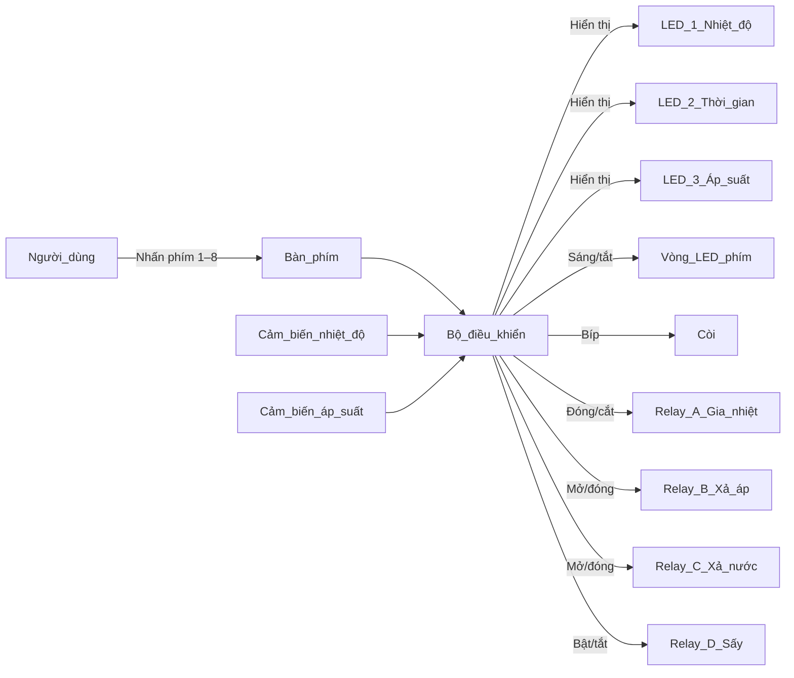

# Hệ thống tiệt trùng - BS86D12C

# Quy trình hoạt động thiết bị tiệt trùng 

> Mục tiêu: người dùng hiểu được thiết bị sẽ làm gì, khi nào, và nên bấm nút nào.

---

## 1. Tổng quan thiết bị

Thiết bị có:

- **3 cụm LED 7 đoạn (LED-1, LED-2, LED-3)**:
  - **LED-1**: hiển thị **nhiệt độ** (°C).
  - **LED-2**: hiển thị **thời gian** (phút) – thời gian cài đặt / đang đếm / tổng thời gian (tối thiểu) chu trình.
  - **LED-3**: hiển thị **áp suất** trong buồng (đơn vị kPa). 

- **Vòng LED quanh các phím 1→8** (KEY1…KEY8) dùng để báo:
  - Phím nào đang được chọn để cài đặt.
  - Hướng tăng/giảm (cho phím thời gian, nhiệt độ).
  - Trạng thái “RUN” thông qua các vị trí LED D11.
  - D4 / D5 chưa định nghĩa

- **Còi (buzzer)**:
  - Kêu ngắn khi **bấm phím**.
  - Kêu theo nhịp khi **cảnh báo lỗi / nguy hiểm**.
  - Kêu dài (60 giây) khi **kết thúc chu trình tiệt trùng**. 

- **Các relay/triac bên trong (người dùng không cần thấy trực tiếp)**:
  - **Relay A**: gia nhiệt (điện trở đun nóng).
  - **Relay B**: van xả áp (xả khí).
  - **Relay C**: van xả nước.
  - **Relay D**: sấy.
  - **Buzzer E**: còi báo.

---

## 2. Sơ đồ khối (ở mức người dùng)

## 3. Các trạng thái chính của máy
### 3.1. Khi bật nguồn – trạng thái BOOT

- Máy khởi động, tắt hết relay A/B/C/D, còi có thể nháy 3 lần ngắn (demo khởi động). 

- Sau một khoảng thời gian ngắn, máy đo nhiệt độ hiện tại trong buồng:

    - Nếu nhiệt độ thấp, máy vào trạng thái chờ (IDLE).

    - Nếu nhiệt độ quá cao so với ngưỡng cho phép khi khởi động, máy vào trạng thái LOCKED (khóa an toàn). 

 

### 3.2. Trạng thái LOCKED (khóa vì máy đang nóng khi bật nguồn)

**Điều kiện**:

Bật nguồn khi buồng đang quá nóng (ví dụ vừa chạy xong mà tắt/bật lại ngay). 

 
**Hành vi**:

- Máy mở van xả áp (B = 1) để giảm áp/nhiệt, hiển thị lỗi trên LED 1 (ERR) và nháy còi. 

- Sau khi nhiệt độ giảm xuống dưới ngưỡng an toàn, máy tự động trở lại trạng thái `IDLE` và cho phép sử dụng bình thường. 

Người dùng **không** thao tác gì, chỉ chờ máy tự xả & về IDLE.

### 3.3. Trạng thái IDLE (chờ)

Ở IDLE, máy:

Không chạy chu trình nào, tất cả relay ở trạng thái an toàn (không gia nhiệt, không xả nước, không sấy). 

`LED-1`: hiển thị nhiệt độ hiện tại trong buồng. 

`LED-2`:

- Nếu không chỉnh thời gian: hiển thị tổng thời gian của chương trình (T1 + T21 + T22 + T3 + T4). 

- Nếu đang chỉnh, sẽ hiển thị giá trị của mục đang chỉnh (xem phần dưới).

`LED-3`: luôn hiển thị áp suất trong buồng. 

Đây là trạng thái để:
- Cài nhiệt độ tiệt trùng.
- Cài thời gian các giai đoạn.
- Chọn chế độ QUICK hay chế độ tiệt trùng 1–4.
- Nhấn START để bắt đầu chu trình.

### 3.4. Trạng thái DANGER (quá nhiệt trong khi máy đang chạy / đang chờ)

Điều kiện:

- Nhiệt độ vượt ngưỡng nguy hiểm `nhiệt độ > 140°C`. 

- Hành vi:
    - Tắt gia nhiệt (A = 0, D = 0).
    - Mở van xả áp (B = 1) liên tục để xả. 
    - LED-1 hiển thị nhiệt độ thực tế.
    - LED-2 hiển thị lỗi (ERR), nháy và kèm còi. 

- Thoát khỏi DANGER:
   - Khi nhiệt độ đã xuống mức an toàn và lỗi đã được xóa, máy tự quay về IDLE. 

- Nhấn phím START trong trạng thái DANGER có thể dùng để xóa cờ lỗi sau khi đã an toàn. 

## 4. Chức năng các phím
**4.1. Nhóm phím nhiệt độ (KEY1, KEY2, KEY3)**

- KEY1 – Cài đặt nhiệt độ:
    - Nhấn 1 lần:
        - Vào chế độ cài nhiệt độ.
        - LED-1 chuyển sang hiển thị nhiệt độ cài đặt (thay vì nhiệt độ thực).
        - Đèn vòng tại KEY1 sáng. 

    - Nhấn lần nữa:

        - Thoát chế độ cài, trở lại hiển thị nhiệt độ thực tế.

- KEY2 – Giảm nhiệt độ (min 121°C). Khi đang ở chế độ cài nhiệt độ:

    - Nhấn sẽ giảm nhiệt độ cài đặt, không thấp hơn 121°C. 

- KEY3 – Tăng nhiệt độ (max 134°C). Khi đang ở chế độ cài nhiệt độ
    - Nhấn sẽ tăng nhiệt độ cài đặt, không vượt quá 134°C

- Giữ lâu KEY2/KEY3: tăng/giảm nhanh liên tục. 

**4.2. Nhóm phím thời gian (KEY4, KEY5, KEY6)**

Thiết bị có 5 loại thời gian:

    T1: Thời gian tiệt trùng chính.

    T21: Thời gian xả áp lần 1.

    T22: Thời gian xả áp lần 2.

    T3: Thời gian xả nước.

    T4: Thời gian sấy. 

`KEY4` – Chọn loại thời gian cần chỉnh

Mỗi lần nhấn KEY4, máy lần lượt chọn:

    T1 → T21 → T22 → T3 → T4 → thoát. 

- Khi đang chỉnh:

    - Vòng LED quanh KEY4 sáng.

    - LED-2 sẽ hiển thị đúng giá trị của loại thời gian đang chọn.

`KEY5` – Giảm thời gian, `KEY6` – Tăng thời gian

Khi đang ở chế độ chỉnh thời gian (đã bấm KEY4):

    KEY5: giảm phút.
    KEY6: tăng phút.

Giữ lâu → tăng/giảm nhanh liên tục. 

  

**4.3. Phím QUICK (KEY7)**

Sử dụng khi muốn chạy nhanh: chỉ đun đến nhiệt độ cài đặt rồi dừng, không dùng các timer T1/T21/T22/T3/T4. 

Cách dùng:

Khi máy đang IDLE, nhấn KEY7:

Máy bật chế độ QUICK, vòng LED KEY7 sáng.

Nhiệt độ cài đặt sẽ luân phiên 121°C ↔ 134°C mỗi lần bấm. 

Bấm đến lần thứ 3 → tắt chế độ QUICK, trở về bình thường. 

Khi QUICK đang chạy, không thể bật lại QUICK hoặc START mới (đã được khóa an toàn trong code). 

  
**4.4. Phím START / STOP (KEY8)**

Nhấn khi IDLE:

- Nếu đang bật QUICK ( KEY 7 sáng) → máy chạy chế độ QUICK.

- Nếu không bật QUICK → máy tự chọn chế độ tiệt trùng 1–4 dựa trên các thời gian T1, T21, T22, T3, T4 đã cài (phần dưới). 

  
- Nhấn giữ lâu khi máy đang chạy (bất kỳ chế độ nào):

    - Hủy chu trình đang chạy, tắt hết relay, tắt đèn RUN/END. 

- Nhấn trong trạng thái DANGER:

    - Dùng để xóa cờ nguy hiểm sau khi nhiệt độ đã trở về an toàn. 

## 5. Cách máy tự chọn chế độ tiệt trùng 1–4

Người dùng không chọn trực tiếp mode 1/2/3/4.

Máy tự suy ra “chế độ nào” dựa trên những thời gian nào > 0:

- Nếu chỉ có:
    - T1 > 0
    - T21, T22, T3, T4 đều = 0
    ⇒ `Tiệt trùng 1` (chỉ đun – không xả áp, không xả nước, không sấy). 
- Nếu:
   -  Có T1, T21, T22
    - T3, T4 = 0
    ⇒ `Tiệt trùng 2` (có xả áp 2 lần, không xả nước, không sấy). 
- Nếu:
    - Có T1, T21
    - T22, T3, T4 = 0
    ⇒ `Tiệt trùng 3` (có xả áp, có xả nước, không sấy). 
- Nếu:
    - Có đủ T1, T21, T22, T3, T4
    ⇒ Tiệt trùng 4 (đầy đủ: xả áp, xả nước, sấy). 

- Nếu thời gian cài đặt không rơi vào các tổ hợp trên, máy báo lỗi (ERR) và không cho START.

## 6. Quy trình vận hành từ góc nhìn người dùng

### 6.1. Chuẩn bị trước khi chạy

1. **Bật nguồn** thiết bị.
2. Đợi máy khởi động:
   - Nếu buồng đang quá nóng, máy có thể vào trạng thái **LOCKED** vài phút để tự xả, sau đó tự quay về **IDLE**.
3. Khi ở **IDLE**:
   - **LED-1**: hiển thị **nhiệt độ hiện tại** trong buồng.
   - **LED-2**: hiển thị **tổng thời gian của chương trình** (nếu đã cài).
   - **LED-3**: hiển thị **áp suất hiện tại**.

---

### 6.2. Cài đặt nhiệt độ tiệt trùng

1. Nhấn **KEY1** để vào chế độ cài nhiệt độ:
   - LED-1 chuyển sang hiển thị **nhiệt độ cài đặt**.
   - Đèn vòng quanh KEY1 sáng.
2. Dùng:
   - **KEY2**: giảm nhiệt độ cài đặt.
   - **KEY3**: tăng nhiệt độ cài đặt.
   - Giới hạn từ **121°C đến 134°C** (có thể tùy cấu hình).
3. Nhấn lại **KEY1** để thoát chế độ cài, LED-1 quay về hiển thị **nhiệt độ thực tế**.

---

### 6.3. Cài đặt thời gian các giai đoạn

Thiết bị dùng 5 loại thời gian:

- **T1**  – Thời gian tiệt trùng chính.
- **T21** – Thời gian xả áp lần 1.
- **T22** – Thời gian xả áp lần 2.
- **T3**  – Thời gian xả nước.
- **T4**  – Thời gian sấy.

Cách cài:

1. Nhấn **KEY4** nhiều lần để chọn loại thời gian:
   - Lần 1: chỉnh **T1**. Còi kêu 1 nhịp
   - Lần 2: chỉnh **T21**. Còi kêu 2 nhịp
   - Lần 3: chỉnh **T22**. Còi kêu 3 nhịp
   - Lần 4: chỉnh **T3**. Còi kêu 4 nhịp
   - Lần 5: chỉnh **T4**. Còi kêu 5 nhịp 
   - Lần tiếp theo: thoát chế độ cài.
2. Khi đang chọn một loại thời gian:
   - **LED-2** hiển thị giá trị của loại thời gian đó (đơn vị phút).
   - Đèn quanh KEY4 bật.
3. Dùng:
   - **KEY5**: giảm thời gian.
   - **KEY6**: tăng thời gian.
   - Nhấn giữ để tăng/giảm nhanh.  ( giữ tối đa 5s, và tăng 5 đơn vị mỗi giây)
4. Khi cài xong, tiếp tục nhấn KEY4 đến khi thoát:
   - **LED-2** quay về hiển thị **tổng thời gian tối thiểu chương trình** (T1 + T21 + T22 + T3 + T4).

---

### 6.4. Chọn QUICK hay chương trình 1–4

- **Chạy chương trình chuẩn (1–4)**:
  - Không bật QUICK.
  - Cài đặt các thời gian T1/T21/T22/T3/T4 theo ý muốn.
  - Thiết bị sẽ tự xác định đó là mode 1, 2, 3 hay 4 (xem mục 7).

- **Chạy QUICK**:
  1. Khi đang ở IDLE, nhấn **KEY7**:
     - Đèn vòng quanh KEY7 sáng → QUICK đang được bật.
     - Mỗi lần bấm KEY7, nhiệt độ QUICK sẽ luân phiên giữa **121°C** và **134°C**.
  2. Nhấn **KEY8 (START)** để bắt đầu QUICK.
  3. Bấm KEY7 đến lần thứ 3 sẽ tắt QUICK và trở về chế độ bình thường.

---

### 6.5. Bắt đầu chu trình (START)

1. Hướng dẫn người dùng chuẩn bị lắp đặt máy/ hệ thống điện kết nối ngoại vi.
2. Ở trạng thái **IDLE**, nhấn **KEY8 (START)**:
   - Nếu QUICK đang bật → chạy **chế độ QUICK**.
   - Nếu QUICK tắt → thiết bị **tự chọn chế độ 1–4** dựa trên các thời gian T1/T21/T22/T3/T4.
3. Nếu cấu hình thời gian không hợp lệ:
   - Thiết bị báo lỗi **ERR**, không chạy.
4. Nếu chương trình hợp lệ:
   - Đèn **RUN** D11 sáng.
   - Thiết bị bắt đầu điều khiển gia nhiệt / xả áp / xả nước / sấy theo chu trình tương ứng.

---

### 6.6. Trong khi đang chạy

- **LED-1**: hiển thị nhiệt độ hiện tại trong buồng.
- **LED-2**: hiển thị **thời gian còn lại** của từng `Ti` (phút) giai đoạn đang chạy.
- **LED-3**: hiển thị áp suất hiện tại.

Người dùng có thể:

- Quan sát diễn biến nhiệt độ, thời gian, áp suất.
- **Nhấn giữ > 1s KEY8** để **hủy chu trình đang chạy** (STOP khẩn).

---

### 6.7. Khi kết thúc chu trình

Khi chu trình hoàn tất (tùy mode):

1. Thiết bị tắt toàn bộ gia nhiệt / xả / sấy.
2. **LED-2** hiển thị chữ **END**.
3. Còi **kêu khoảng 60 giây** để báo kết thúc.
4. Sau đó:
   - Còi tắt.
   - Thiết bị trở về **IDLE**, tiếp tục hiển thị nhiệt độ & áp suất.
5. Người dùng:
   - Có thể đợi hoặc tiếp tục cài đặt các tham số sau khi còi tắt
---

### 6.8. Hủy chu trình & xử lý tình huống

- **Muốn dừng giữa chừng**:
  - Nhấn và giữ **KEY8 (START)** vài giây cho đến khi đèn RUN tắt → chu trình bị hủy, thiết bị về IDLE.

- **Thiết bị báo ERR**:
  - Có thể do tổ hợp thời gian không hợp lệ hoặc lỗi cấu hình.
  - Xử lý:
    - Kiểm tra lại các thời gian T1/T21/T22/T3/T4.
    - Cài đặt lại cho đúng một trong các tổ hợp hợp lệ.
    - Nếu cần, tắt/bật lại nguồn để reset.

- **Thiết bị vào trạng thái DANGER (quá nhiệt)**:
  - Thiết bị tự động:
    - Tắt gia nhiệt.
    - Mở van xả áp.
    - Hiển thị cảnh báo và kêu còi.
  - Đợi đến khi nhiệt độ & áp suất về an toàn.
  - Sau đó, có thể nhấn KEY8 để xóa cảnh báo (tùy phiên bản firmware).

---

## 7. Tóm tắt hành vi từng chương trình (1–4 + QUICK)

> Người dùng **không chọn trực tiếp mode 1/2/3/4**.  
> Thiết bị **tự xác định chế độ** dựa trên việc các thời gian T1/T21/T22/T3/T4 khác 0 hay không.

---

### 7.1. Điều kiện chọn mode (tự động)

- **Tiệt trùng 1** – Chỉ tiệt trùng, không xả áp/nước/sấy  
  - Điều kiện:
    - `T1 > 0`
    - `T21 = T22 = T3 = T4 = 0`

- **Tiệt trùng 2** – Có xả áp 2 lần, không xả nước, không sấy  
  - Điều kiện:
    - `T1 > 0`, `T21 > 0`, `T22 > 0`
    - `T3 = T4 = 0`

- **Tiệt trùng 3** – Có xả áp, có xả nước, không sấy  
  - Điều kiện:
    - `T1 > 0`, `T21 > 0`
    - `T22 = T3 = T4 = 0`

- **Tiệt trùng 4** – Đầy đủ: xả áp, xả nước, sấy  
  - Điều kiện:
    - `T1 > 0`, `T21 > 0`, `T22 > 0`, `T3 > 0`, `T4 > 0`

- Nếu cấu hình **không khớp** với bất kỳ tổ hợp nào ở trên → báo **ERR**, không cho START.

---

### 7.2. Chương trình Tiệt trùng 1

**Tính chất:**

- Chỉ có **giai đoạn tiệt trùng chính T1**.
- Không xả áp, không xả nước, không sấy.

**Dòng chảy từ góc nhìn người dùng:**

1. Nhấn START:
   - Máy đun nóng buồng đến nhiệt độ cài (LED-1 tăng dần).
2. Khi đạt nhiệt độ cài:
   - LED-2 bắt đầu **đếm ngược T1**.
3. Khi T1 về 0:
   - Máy ngừng gia nhiệt.
   - Đợi nhiệt độ giảm xuống dưới ngưỡng an toàn (ví dụ ~70°C).
   - LED-2 hiển thị **END**, còi báo khoảng 60 giây.
4. Người dùng đợi còi tắt để có thể thao tác tiếp.

### **Timeline Relay**
| Giai đoạn | A (Gia nhiệt) | B (Xả áp) | C (Xả nước) | D (Sấy) | Ghi chú |
|----------|----------------|-----------|-------------|---------|---------|
| START_STERI_1 | **ON** | OFF | OFF | OFF | Bắt đầu gia nhiệt |
| HEATING_1 | **ON** | OFF | OFF | OFF | Đun đến nhiệt độ cài |
| Khi đạt nhiệt độ | **ON** → không đổi | OFF | OFF | OFF | Bắt đầu đếm T1 |
| STERING_1 (T1) | **ON** | OFF | OFF | OFF | Giữ nhiệt suốt T1 |
| END_STERI_1 | **OFF** | OFF | OFF | OFF | Chờ nguội ≤ 70°C sau đó mới báo END + còi 60s|
| STOP_STERI_1 | **OFF** | OFF | OFF | OFF | Kết thúc |

---

### 7.3. Chương trình Tiệt trùng 2

**Tính chất:**

- Có **tiệt trùng chính (T1)**.
- Có **2 lần xả áp (T21, T22)**.
- Không xả nước, không sấy.

**Dòng chảy tóm tắt:**

1. Nhấn START:
   - Máy đun nóng đến nhiệt độ cài.
2. Đạt nhiệt độ:
   - Mở van xả áp lần 1 trong **T21** phút.
   - LED-2 đếm ngược **T21**.
3. Hết T21:
   - Đóng van xả, tiếp tục giữ nhiệt, bắt đầu đếm **T1** (tiệt trùng chính).
4. Hết T1:
   - Tắt gia nhiệt.
   - Mở van xả áp lần 2 trong **T22** phút.
   - LED-2 hiển thị thời gian xả (T22), việc đếm có thể phụ thuộc nhiệt độ (chỉ đếm khi buồng còn nóng).
5. Khi thời gian/điều kiện kết thúc thỏa mãn:
   - Đóng van xả.
   - Hiển thị **END**, còi báo.
6. Người dùng chờ buồng an toàn, sau đó mở lấy đồ.
### **Timeline Relay**
| Giai đoạn | A (Gia nhiệt) | B (Xả áp) | C (Nước) | D (Sấy) | Ghi chú |
|----------|----------------|-----------|----------|---------|---------|
| START_STERI_2 | **ON** | OFF | OFF | OFF | Đun nóng buồng |
| HEATING_21 | **ON** | OFF | OFF | OFF | Chờ đạt nhiệt độ |
| RELEASE_21 (T21) | **ON** | **ON** | OFF | OFF | Xả áp lần 1 |
| HEATING_22 | **ON** | OFF | OFF | OFF | Sau xả áp 1, giữ nhiệt lại |
| Khi đạt nhiệt độ | **ON** | OFF | OFF | OFF | Bắt đầu T1 |
| STERING_2 (T1) | **ON** | OFF | OFF | OFF | Tiệt trùng chính |
| RELEASE_22 (T22) | OFF | **ON** | OFF | OFF | Xả áp lần 2 đến khi 40°C hoặc T22 = 0 |
| END_STERI_2 | OFF | OFF | OFF | OFF | Chờ nguội – END - Còi báo 60s |
| STOP_STERI_2 | OFF | OFF | OFF | OFF |  Kết thúc|
---

### 7.4. Chương trình Tiệt trùng 3

**Tính chất:**

- Có **tiệt trùng chính (T1)**.
- Có **xả áp (T21)**.
- Có **xả nước (T3)**.
- Không sấy.

**Dòng chảy tóm tắt:**

1. Nhấn START:
   - Máy gia nhiệt đến nhiệt độ cài.
2. Đạt nhiệt độ:
   - Mở van xả áp trong **T21** (LED-2 đếm T21).
3. Hết T21:
   - Đóng van xả.
   - Giữ điều kiện tiệt trùng, đếm **T1** (LED-2 đếm ngược).
4. Hết T1:
   - Tắt gia nhiệt.
   - Mở van xả nước (C) **liên tục** để xả nước/giảm nhiệt.
5. Khi nhiệt độ trong buồng xuống dưới ngưỡng an toàn:
   - Đóng van xả nước.
   - Hiển thị **END**, còi báo.
6. Người dùng đợi thêm nếu cần, rồi mở cửa lấy đồ.

### **Timeline Relay**
| Giai đoạn | A | B | C | D | Ghi chú |
|----------|---|---|---|---|----------|
| START_STERI_3 | **ON** | OFF | OFF | OFF | Bắt đầu đun |
| HEATING_31 | **ON** | OFF | OFF | OFF | Chờ đạt nhiệt |
| RELEASE_3 (T21) | **ON** | **ON** | OFF | OFF | Xả áp |
| HEATING_32 | **ON** | OFF | OFF | OFF | Chuẩn bị tiệt trùng |
| STERING_3 (T1) | **ON** | OFF | OFF | OFF | Tiệt trùng |
| VENT_AND_STER3 | OFF | OFF | **ON** | OFF | Xả nước không giới hạn |
| FINISH_3 | OFF | OFF/ON khi < 70 độ\* | **ON → OFF khi <40°C** | OFF | Buồng nguội dần END + còi |
| STOP_STERI_3 | OFF | OFF | OFF | OFF | Kết thúc |
*Cần check lại quy trình chỗ này - đoạn kết thúc*
---

### 7.5. Chương trình Tiệt trùng 4

**Tính chất:**

- Đầy đủ: **xả áp, xả nước, tiệt trùng, sấy**.
- Dùng cả 5 thời gian: T1, T21, T22, T3, T4.

**Dòng chảy (khái quát):**

1. Nhấn START:
   - Gia nhiệt đến nhiệt độ cài.
2. Giai đoạn xả áp lần 1:
   - Mở van xả áp theo **T21**.
3. Giai đoạn tiệt trùng chính:
   - Giữ nhiệt độ và đếm **T1**.
4. Giai đoạn xả áp / xả nước:
   - Kết hợp **T22** và **T3** tùy thiết lập:
     - Xả áp để hạ áp suất.
     - Xả nước để hạ nước dư trong buồng.
5. Giai đoạn sấy:
   - Bật gia nhiệt sấy (D) và giữ trong **T4** phút.
6. Kết thúc:
   - Tắt sấy, tắt toàn bộ van/relay.
   - Hiển thị **END**, còi báo.
7. Người dùng chờ an toàn rồi mở buồng lấy đồ.

### **Timeline Relay**
| Giai đoạn | A | B | C | D | Ghi chú |
|----------|---|---|---|---|---------|
| START_STERI_4 | **ON** | OFF | OFF | OFF | Gia nhiệt |
| HEATING_41 | **ON** | OFF | OFF | OFF | Chờ đạt nhiệt |
| VENT_4 (T21) | **ON** | **ON** | OFF | OFF | Xả áp lần 1 |
| STERI_42 (T1) | **ON** | OFF | OFF | OFF | Tiệt trùng chính |
| DRAIN_4 (T22 + T3) | OFF | **ON (áp)** | **ON (nước)** | OFF | Kết hợp xả áp + xả nước |
| DRY_HEAT_4 (T4) | **ON** | OFF | OFF | **ON** | Sấy ở nhiệt độ cao |
| DRY_HOLD_4 | OFF | OFF | OFF | **ON** | Duy trì sấy |
| END_STERI_4 | OFF | OFF | OFF | OFF | END + còi |
| STOP_STERI_4 | OFF | OFF | OFF | OFF | Hoàn tất |
*Quy trình 4 cũng cần check lại*
---

### 7.6. Chương trình QUICK

**Mục đích:**

- Đun buồng nhanh đến **một nhiệt độ xác định** (121°C hoặc 134°C) rồi dừng.
- Không chạy đủ chu trình xả / sấy như các mode 1–4.

**Cách chạy và cảm nhận:**

1. Ở IDLE:
   - Nhấn KEY7 để bật QUICK.
   - Chọn nhiệt độ QUICK (121°C hoặc 134°C) bằng cách bấm thêm KEY7.
2. Nhấn START:
   - Máy chỉ **gia nhiệt** đến nhiệt độ QUICK.
3. Khi đạt nhiệt độ QUICK:
   - Tắt gia nhiệt.
   - Hiển thị **kết thúc** (dạng END hoặc tương đương).
   - Còi báo trong một khoảng thời gian ngắn.
4. Dùng trong những trường hợp cần làm nóng nhanh, không yêu cầu đủ chu trình tiệt trùng chuẩn.

---
## 8. Hủy chu trình & xử lý tình huống

### Dừng chu trình giữa chừng
- Giữ **KEY8 (START)** cho đến khi đèn **RUN** tắt, còi ngừng và máy trở về trạng thái **IDLE**.  
- **USER_PROGRAM_C**

---

### Máy báo `ERR`
**Nguyên nhân thường gặp:**
- Thời gian cài đặt không khớp với bất kỳ mode hợp lệ nào (**1–4**).  
- Lỗi khác (EEPROM, cấu hình…) – hiển thị bằng nháy **“ERR”** trên một trong các LED.

**Giải pháp:**
- Kiểm tra lại các thông số: **T1 / T21 / T22 / T3 / T4**.  
- Tắt/bật lại máy nếu cần.  
- Xem lại hướng dẫn cấu hình chương trình.

---

### Máy vào trạng thái `DANGER`
- Đợi máy tự xả áp và giảm nhiệt.  
- Khi an toàn, nhấn **START** để xóa lỗi nếu cảnh báo vẫn còn.
